# Disaster Coordination Platform (SIH 2026)

## Real-Time Disaster Early-Warning & Resource Coordination Platform
A state-of-the-art, map-based disaster response and coordination dashboard. This platform leverages deterministic clustering and capacity/suitability-aware allocation logic to close the critical feedback loop between citizens raising alarms and authorities dispatching verified rescue resources.

---

## 📌 Problem Statement
During severe disasters like floods, cyclones, and landslides, information flow remains critical but highly fragmented. 
- **Communication Gaps:** Information moves too slowly between citizens, local administrations, and rescue teams.
- **Unverified Reports:** Authorities receive reports via scattered, unverified channels (social media, calls), making triage difficult.
- **Resource Silos:** Rescue teams, shelters, and medical assets operate on siloed capacity data that isn't connected to incoming distress reports.
- **The Bottleneck:** The handoff between a citizen raising an alarm and a rescue team being dispatched is manual, slow, and unverified.

> [!NOTE]
> **Context on India's Cell Broadcast Alert System:** Although tested nationwide, network-independent mass alerts are not yet operational for routine disaster use. As of August 2026, the primary mass-alert channel remains SMS, which depends on network availability and suffers from delivery latency. This platform's architecture is built specifically around this reality, establishing reliable fallback loops.

---

## 🚀 Solution Overview
A unified map-based dashboard fed by geo-tagged citizen reports, built on top of two deterministic engines:

1. **Geo-tagged Reporting:** Simple, low-bandwidth, and login-free form allowing citizens to file a rescue request or pledge a resource in under 30 seconds.
2. **Trust Layer (Clustering Engine):** Automatic grouping of reports based on spatial (~200m) and temporal (15 minutes) proximity. An incident is marked "Verified" only when $3+$ independent citizen sessions report it.
3. **Allocation Engine:** Smart matching system that filters out exhausted resources, matches resource tags to disaster type (e.g., matching a boat/flood-shelter specifically to a flood zone), ranks them, and recommends the top 2-3 candidates.
4. **Human-Confirmed Dispatch:** Maintains accountability. The system *only* recommends; an authorized user must click "Confirm" to dispatch resources and deduct capacity.
5. **Live Dashboard:** Interactive map reflecting reports, verification states, active resources, and live dispatch routes without requiring page refreshes.

---

## 🔄 Unified End-to-End Workflow
The core loop starts and ends with the citizen:

```mermaid
graph TD
    A[1. Citizen submits report via App/SMS] --> B[2. System validates & geo-stores it]
    B --> C[3. System clusters & auto-verifies 3+ reports]
    C --> D[4. Authority sees live verified pin & ranked resource shortlist]
    D --> E[5. Authority clicks Confirm to dispatch]
    E --> F[6. System updates allocation & resource capacity]
    F --> G[7. Resource status flips to En Route -> At Scene]
    G --> H[8. Authority marks incident Resolved]
    H --> I[9. System broadcasts final status]
    I --> J[10. Citizen sees status update on Your Reports view]

    style A fill:#f96,stroke:#333,stroke-width:2px
    style J fill:#f96,stroke:#333,stroke-width:2px
    style B fill:#3498db,stroke:#333,stroke-width:2px
    style C fill:#3498db,stroke:#333,stroke-width:2px
    style F fill:#3498db,stroke:#333,stroke-width:2px
    style I fill:#3498db,stroke:#333,stroke-width:2px
    style D fill:#2c3e50,stroke:#333,stroke-width:2px
    style E fill:#2c3e50,stroke:#333,stroke-width:2px
    style G fill:#2c3e50,stroke:#333,stroke-width:2px
    style H fill:#2c3e50,stroke:#333,stroke-width:2px
```



---

## 🛡️ Core Defensibility Features

### 1. Trust Layer
Protects the platform against spam and false alarms:
- **Match Window:** New reports are dynamically checked against others within **~200m** and **15 minutes**.
- **Independence:** Only distinct, anonymous user sessions count. A single user spamming does not escalate the verification status.
- **Verified Threshold:** Exactly **3+ independent reports** on the same cluster triggers the visual "Verified" badge on the map.

### 2. Allocation Engine
Smarter matching than basic "nearest pin" queries:
- **Capacity-Aware:** Fully occupied/exhausted resources are excluded from recommendation.
- **Type-Aware:** Match criteria enforce suitability (e.g., flood shelters are not suggested for landslides).
- **Ranked Shortlist:** Recommends the top 2-3 candidates by proximity and capacity, presenting authorities with options.

---

## ✨ Stand-Out Differentiators (Beyond Core)
- **Community Resource Pool:** Citizens can *pledge* help (private vehicles, food, water, boats) using the same reporting form. Pledges enter the same database, are ranked by the allocation engine, and require authority confirmation before deployment.
- **"I'm Safe" Check-in:** Generation of a shareable, lightweight, read-only link for family members to track safety status.
- **Multi-language Reporting UI:** Seamless language toggle (Hindi/Regional) to cater to rural/local rescue scenarios.
- **Auto-generated Ops Brief:** Instantly formatted top-line summaries (e.g., *"4 critical, 2 unresolved > 1hr, 3 shelters near capacity"*).
- **QR-code Shelter Posters:** Print-friendly QR codes placed at camps to direct citizens to the zero-login reporting form.

---

## 📅 Development Roadmap (5-Day Build Plan)

| Day | Focus | Exit Criteria |
| :--- | :--- | :--- |
| **Day 1** | Backend foundation, PostGIS setup, schema, seed resources for a sample city. | A nearby-distance query returns correct sorted results. |
| **Day 2** | Citizen reporting flow end-to-end (with photo upload), map rendering. | A citizen report appears as a pin on the dashboard. |
| **Day 3** | Live updates, clustering/verification, and allocation engine. | 3 reports auto-verify a cluster; a ranked shortlist is generated. |
| **Day 4** | Confirmation flow, resource status, resolution, and citizen status view. | Full end-to-end loop runs without manual DB edits. |
| **Day 5** | Production walkthrough, testing, and 4-minute demo recording. | Demo matches the planned script without live failures. |

---

## 🛠️ Tech Stack & Setup

- **Frontend:** Next.js (App Router), Tailwind CSS
- **State/Database:** PostgreSQL / PostGIS (or mock geo-spatial logic)
- **Real-time:** WebSockets / Polling

### Installation & Run

1. Clone the repository:
   ```bash
   git clone https://github.com/shuvam776/SIH-2026.git
   cd SIH-2026
   ```

2. Install dependencies:
   ```bash
   npm install
   ```

3. Run the development server:
   ```bash
   npm run dev
   ```
   Open [http://localhost:3000](http://localhost:3000) to view the application.
