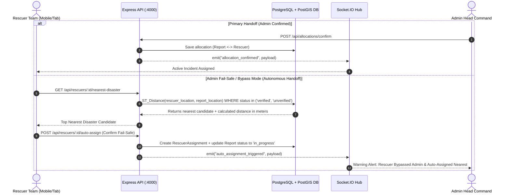

# Exhaustive Backend Implementation Plan: Rescuer Portal & Autonomous Nearest-Disaster Handoff Engine

> **Target Executor:** Claude Code / Automated AI Coding Agent  
> **System Scope:** Express 5 + PostgreSQL (Supabase / PostGIS) + Prisma 7 + Socket.IO 4  
> **Goal:** Implement database persistence, PostGIS spatial nearest-neighbor search, supply inventory tracking, and autonomous disaster assignment fallback for field rescue units.

---

## 1. Architecture & Fail-Safe Assignment Overview



---

## 2. Database Schema Extensions (`server/prisma/schema.prisma`)

Add the following Enums and Models to [`server/prisma/schema.prisma`](file:///d:/SIH%20internal/SIH-2026/server/prisma/schema.prisma):

```prisma
// ────────── Rescuer Enums & Models ──────────

enum RescuerType {
  rescue_team
  boat
  ambulance
  shelter
  medical_van
}

enum RescuerStatus {
  available
  en_route
  at_scene
  resting
}

enum AssignmentSource {
  admin_dispatch
  nearest_fallback
}

model RescuerUnit {
  id              String           @id @default(uuid())
  name            String
  callsign        String           @unique
  type            RescuerType
  leader_name     String
  phone           String
  status          RescuerStatus    @default(available)
  created_at      DateTime         @default(now())

  // Note: Geometry location column added via PostGIS raw migration (ST_Point)
  supplies        SupplyInventory?
  assignments     RescuerAssignment[]
}

model SupplyInventory {
  id                      String      @id @default(uuid())
  rescuer_id              String      @unique
  food_ration_kits        Int         @default(100)
  food_ration_capacity    Int         @default(200)
  water_liters            Int         @default(400)
  water_capacity_liters   Int         @default(800)
  medical_kits            Int         @default(15)
  medical_kits_capacity   Int         @default(30)
  iv_fluids_count         Int         @default(40)
  shelter_beds_available  Int         @default(0)
  shelter_beds_total      Int         @default(0)
  life_jackets            Int         @default(30)
  fuel_liters             Int         @default(100)
  sat_phone_battery_pct   Int         @default(100)
  updated_at              DateTime    @updatedAt

  rescuer                 RescuerUnit @relation(fields: [rescuer_id], references: [id], onDelete: Cascade)
}

model RescuerAssignment {
  id               String           @id @default(uuid())
  rescuer_id       String
  report_id        String
  source           AssignmentSource @default(admin_dispatch)
  assigned_at      DateTime         @default(now())
  completed_at     DateTime?

  rescuer          RescuerUnit      @relation(fields: [rescuer_id], references: [id])
  report           Report           @relation(fields: [report_id], references: [id])
}
```

---

## 3. PostGIS Nearest-Neighbor Spatial Query

Create [`server/src/utils/rescuerGeo.ts`](file:///d:/SIH%20internal/SIH-2026/server/src/utils/rescuerGeo.ts):

```typescript
import pool from "../db";

export interface NearestDisasterResult {
  id: string;
  type: string;
  description: string;
  status: string;
  created_at: Date;
  location_wkt: string;
  distance_meters: number;
  lat: number;
  lng: number;
}

/**
 * Spatial KNN (K-Nearest Neighbor) Query:
 * Calculates the exact geographic distance in meters between a Rescuer unit's current
 * GPS location and all active verified/unverified reports using PostGIS ST_DistanceSphere.
 */
export async function findNearestDisaster(
  rescuerLat: number,
  rescuerLng: number,
  limit: number = 5
): Promise<NearestDisasterResult[]> {
  const query = `
    SELECT
      "id",
      "type",
      "description",
      "status",
      "created_at",
      ST_AsText("location") AS location_wkt,
      ST_Y("location"::geometry) AS lat,
      ST_X("location"::geometry) AS lng,
      ST_DistanceSphere(
        "location"::geometry,
        ST_SetSRID(ST_MakePoint($1, $2), 4326)
      ) AS distance_meters
    FROM "Report"
    WHERE "status" IN ('verified', 'unverified')
    ORDER BY "location"::geometry <-> ST_SetSRID(ST_MakePoint($1, $2), 4326)
    LIMIT $3;
  `;

  const result = await pool.query(query, [rescuerLng, rescuerLat, limit]);
  return result.rows;
}
```

---

## 4. REST API Endpoint Specs

### 4.1 GET `/api/rescuers/:id`
- **Description:** Fetch rescuer profile, location, current status, active assignment, and supply inventory.
- **Success Response (200):**
  ```json
  {
    "id": "demo-team-alpha",
    "name": "NDRF Team Alpha",
    "callsign": "RESCUE-ALPHA-01",
    "type": "rescue_team",
    "status": "available",
    "location_wkt": "POINT(72.8777 19.0760)",
    "supplies": {
      "food_ration_kits": 120,
      "food_ration_capacity": 200,
      "water_liters": 450,
      "shelter_beds_available": 85,
      "shelter_beds_total": 250
    },
    "assignedIncident": null
  }
  ```

### 4.2 GET `/api/rescuers/:id/nearest-disaster`
- **Description:** Compute nearest disaster location via PostGIS when Admin is unresponsive.
- **Query Params:** `?lat=19.0760&lng=72.8777`
- **Success Response (200):**
  ```json
  {
    "nearestDisaster": {
      "id": "INC-1024",
      "type": "flood",
      "description": "Rising floodwaters at Central Market",
      "distance_meters": 1420.5,
      "lat": 19.0850,
      "lng": 72.8820
    }
  }
  ```

### 4.3 POST `/api/rescuers/:id/auto-assign`
- **Description:** Rescuer team self-assigns to the nearest calculated disaster location in Fail-Safe mode.
- **Request Body:**
  ```json
  {
    "report_id": "INC-1024",
    "source": "nearest_fallback"
  }
  ```
- **Success Response (201):**
  ```json
  {
    "message": "Auto-assignment committed",
    "assignment": { "id": "uuid", "source": "nearest_fallback" },
    "reportStatus": "in_progress"
  }
  ```
- **Socket Event Emitted:** `auto_assignment_triggered`

### 4.4 PUT `/api/rescuers/:id/supplies`
- **Description:** Update supply inventory (kits distributed, beds checked in/out).
- **Request Body:**
  ```json
  {
    "food_ration_kits": 110,
    "water_liters": 400,
    "shelter_beds_available": 75
  }
  ```
- **Socket Event Emitted:** `supplies_updated`

### 4.5 PUT `/api/rescuers/:id/status`
- **Description:** Update rescuer state (`available`, `en_route`, `at_scene`, `resting`).
- **Request Body:** `{ "status": "en_route" }`
- **Socket Event Emitted:** `rescuer_status_changed`

---

## 5. Step-by-Step Execution Guide for Claude Code

### Step 1: Update Schema & Run Migration
```bash
cd server
# Add Rescuer models to prisma/schema.prisma
npx prisma db push
```

### Step 2: Create Files in `server/src/`
1. Create `server/src/utils/rescuerGeo.ts` (PostGIS KNN query)
2. Create `server/src/services/rescuerService.ts` (DB transaction logic)
3. Create `server/src/controllers/rescuerController.ts` (Express request handlers)
4. Create `server/src/routes/rescuers.ts` (Router definition)
5. Register router in `server/src/server.ts`:
   ```typescript
   import rescuerRouter from "./routes/rescuers";
   app.use("/api/rescuers", rescuerRouter);
   ```

### Step 3: Seed Initial Rescuer Units & Supplies
Update `server/prisma/seed.ts` to populate `RescuerUnit` and `SupplyInventory` tables with sample units (`demo-team-alpha`, `res-boat-01`, `res-amb-102`, `res-shelter-dharavi`).

### Step 4: Verification Command
Run the simulation script to verify nearest-disaster query and auto-assignment fallback:
```bash
cd server
npx tsx scripts/testRescuer.ts
```
